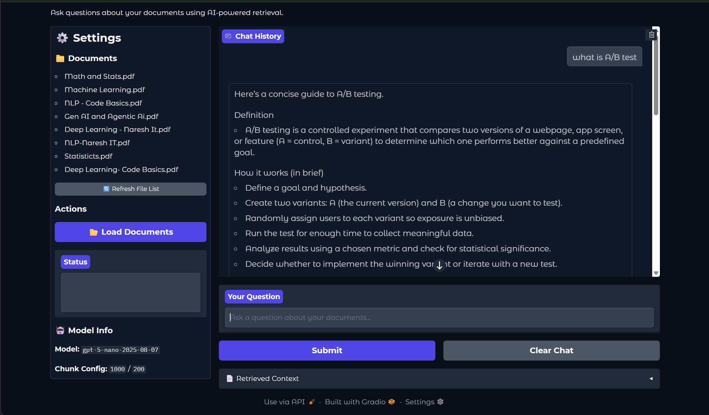

# RAG ReAct Agent


A Retrieval Augmented Generation (RAG) system that retrieves answers from user-provided PDFs using semantic search and a ReAct agent with Tavily web search for questions beyond the knowledge base.

## 🎯 Features

- **FastAPI + Gradio**: Combined backend API and web UI in single application
- Persistent vector store - loads and stores document chunks locally (no need to reload every time)
- Tavily web search fallback for questions outside your documents
- Real-time chat interface with source citations
- Automatic document chunking and embedding
- RESTful API endpoints for external integrations

## 🔄 How It Works

1. **Document Loading**: PDFs are loaded and split into chunks
2. **Embedding**: Text chunks are converted to vector embeddings using OpenAI
3. **Storage**: Embeddings stored in FAISS vector database for fast retrieval
4. **Query**: User question is embedded using the same model
5. **Retrieval**: Similarity search finds top-k relevant chunks from vector store
6. **Generation**: LLM generates answer using retrieved context
7. **Fallback**: If answer is not found in docs, ReAct agent searches the web using Tavily

## 📁 Project Structure

```
rag-react-agent/
├── src/
│   ├── config/              # Configuration settings
│   ├── document_ingestion/  # Document loading and processing
│   ├── vectorstore/         # Vector store management
│   ├── nodes/               # LangGraph nodes (retriever + ReAct agent)
│   ├── graph_builder/       # Workflow graph builder
│   ├── state/               # State management
│   └── utils/               # Utilities (logging)
├── data/                    # PDF documents
├── logs/                    # Application logs
├── app.py                   # FastAPI + Gradio (combined backend + frontend)
├── requirements.txt         # Python dependencies
└── README.md
```

## 🚀 Getting Started

### Prerequisites

- Python 3.8 or higher
- OpenAI API key
- Tavily API key

### Installation

1. Clone the repository

```bash
git clone <your-repo-url>
cd rag-react-agent
```

2. Create and activate virtual environment

```bash
python -m venv venv
venv\Scripts\activate        # Windows
source venv/bin/activate     # Linux/Mac
```

3. Install dependencies

```bash
pip install -r requirements.txt
```

4. Set up environment variables

```bash
cp .env.example .env
# Edit .env and add your OPENAI_API_KEY and TAVILY_API_KEY
```

## 🐳 Docker Deployment

### Build and Run

```bash
docker build -t rag-react-agent .
docker run -p 8000:8000 --env-file .env rag-react-agent
```

## 💻 Usage

### Running the Application

```bash
python app.py
```

The application will start on `http://localhost:8000`

**Access Points:**
- **Web UI (Gradio)**: `http://localhost:8000/`
- **API Documentation**: `http://localhost:8000/docs`
- **API Endpoints**: `http://localhost:8000/api/*`

### Adding Documents

1. Place PDF files in the `data/` folder
2. Click "Load Documents" in the sidebar
3. Documents will be chunked, embedded, and stored in the vector database

### Asking Questions

- Type your question in the chat interface
- The system will search your documents first
- If no relevant answer is found, it will search the web using Tavily
- View answers with source citations and retrieved document chunks

## 📸 Screenshots


_RAG Search interface showing document-based Q&A_

## 📊 Example Use Cases

**Questions about your documents:**

- "What is transfer learning?"
- "Explain the architecture of transformers"
- "What are the key differences between supervised and unsupervised learning?"

**Questions beyond your documents (using Tavily web search):**

- "What are the latest developments in AI?"
- "Explain quantum computing in simple terms"

## 🔌 API Endpoints

**Base URL:** `http://localhost:8000/api`

- **GET** `/api` - Health check endpoint
- **GET** `/api/files` - List all PDF files in data directory
- **POST** `/api/load` - Load and index documents
- **POST** `/api/query` - Query documents with a question
  - Parameters: `question` (string)

**Interactive API Documentation:** Visit `http://localhost:8000/docs` for Swagger UI with interactive testing.

## 📄 License

This project is licensed under the MIT License
